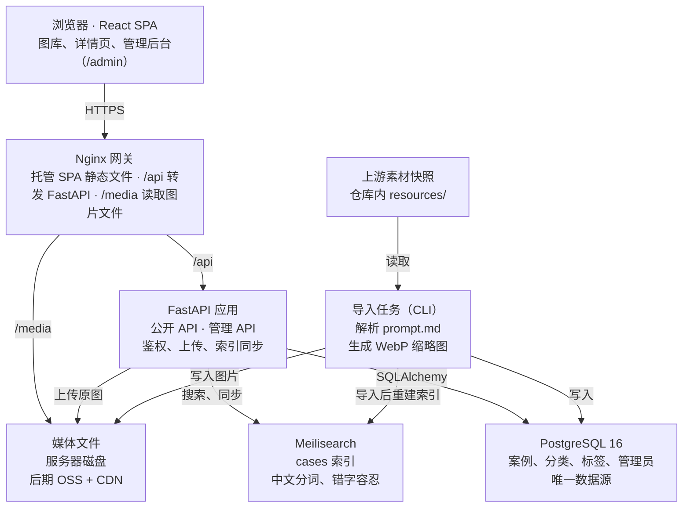
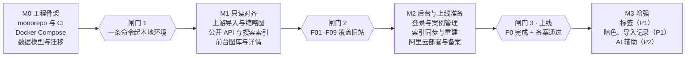

# AI 图集重构：需求与架构

2026-09-28 · 在线版：https://claude.ai/code/artifact/cdcd1efd-84dd-4a46-b79a-ac9be0b2da37

## 1. 背景与目标

新项目把 ai-image-atlas 从「构建时生成 JSON 的纯静态站」升级为「React 前端 + Python 后端 + 数据库」的可运营图库，让内容可以在线维护、检索更快、图片更轻。

**现状（ai-image-atlas）**：Vite + React 单页，构建脚本解析上游 [image-inspirer](https://github.com/wukongnotnull/image-inspirer) 的 13 个分类 `prompt.md`，生成 668 条提示词（336 条有图）、3.2 MB 的 JSON 和 71 MB 原图，部署到 GitHub Pages。

**需要解决的问题**

- 内容只能改上游或改代码后重新构建，无法在线增删改。
- 上游案例编号跨分类重复（668 条仅 397 个唯一编号），以编号命名图片存在覆盖风险。
- 全量 JSON 一次下载，前端内存过滤；无缩略图，卡片直接加载平均约 210 KB 的原图。
- 无 URL 状态，无法分享某个筛选结果或案例链接。

**本期目标**

1. 功能上完整覆盖现有站点：浏览、分类、搜索、仅有图、详情、复制提示词、随机。
2. 数据入库：从仓库内的上游素材快照导入，可重复执行，内部 ID 与上游编号解耦。
3. 后端生成缩略图并分页返回，首屏只加载当前页数据与缩略图。
4. 提供管理后台（仅管理员账号），可在线维护案例、图片和分类。
5. 站内搜索接入 Meilisearch：中文分词、错字容忍、按相关度排序、命中词高亮。
6. 部署到阿里云服务器。

**非目标（本期不做）**：用户注册与收藏、搜索引擎收录（SEO）、在线调用模型生成图片、社区投稿与审核流、多语言界面、原生移动端。

## 2. 用户与使用场景

本期只有两类角色：游客是主体，管理员负责维护内容；不开放注册，管理员账号由命令行创建。

| 角色 | 登录 | 核心场景 |
| --- | --- | --- |
| 游客 | 否 | 从分享链接进入案例页；按分类或关键词找图，打开详情，复制提示词拿去生图 |
| 管理员 | 是 | 新增、编辑、下线案例，上传图片，调整分类与标签，重新导入上游快照并查看结果 |

## 3. 功能需求

P0 是上线门槛（功能覆盖现站点、管理后台与站内搜索），P1 紧随其后，P2 视投入决定，「后续」为本期明确不做。

| 编号 | 模块 | 需求 | 优先级 |
| --- | --- | --- | --- |
| F01 | 浏览 | 瀑布流/网格展示案例卡片（缩略图、标题、分类、提示词摘要），滚动到底分页加载 | P0 |
| F02 | 筛选 | 按分类筛选，分类计数随「仅有图」开关和搜索词联动（含「全部」） | P0 |
| F03 | 站内搜索 | 基于 Meilisearch 匹配标题、分类、作者、中英文提示词；中文分词、英文错字容忍、按相关度排序；输入防抖 300 ms；命中词高亮；可与分类、仅有图、标签组合筛选 | P0 |
| F04 | URL 状态 | 分类、关键词、开关写入查询参数；案例详情有独立路由 `/cases/:id`，可直接分享 | P0 |
| F05 | 详情 | 大图、标题、来源、完整提示词；JSON 格式提示词按代码高亮；上一条/下一条切换 | P0 |
| F06 | 复制 | 一键复制中文或英文提示词，失败时给出提示并降级为选中文本 | P0 |
| F07 | 随机 | 在当前筛选范围内随机打开一个有图案例 | P0 |
| F08 | 上游导入 | 解析仓库内 `resources/image-inspirer` 快照的 `prompt.md` 与图片，按「分类 + 上游编号」幂等更新；已被管理员手工修改的字段不被覆盖；记录新增/更新/失败数 | P0 |
| F09 | 图片处理 | 入库时生成 WebP 缩略图与中图，记录宽高和主色，前端据此预留占位避免抖动 | P0 |
| F10 | 管理后台 | 管理员登录；案例列表、新增、编辑、上下线；上传/替换图片；分类增删改与排序 | P0 |
| F11 | 索引同步 | 案例增删改、上下线后实时更新 Meilisearch；导入完成后全量重建；后台可手动触发重建 | P0 |
| F12 | 标签 | 案例可打多个标签（风格、比例、适用模型等），前台可按标签筛选 | P1 |
| F13 | 暗色模式 | 跟随系统，可手动切换 | P1 |
| F14 | 导入记录 | 后台查看每次导入的上游 commit、耗时、明细与失败原因 | P1 |
| F15 | AI 辅助 | 调用大模型自动翻译中英文提示词、生成标签 | P2 |
| F16 | 以图搜图 | 图片向量化，详情页展示相似案例 | P2 |
| F17 | 用户与收藏 | 注册登录、收藏/取消收藏、我的收藏列表 | 后续 |
| F18 | SEO | 服务端渲染、sitemap、结构化数据，让案例页被搜索引擎收录 | 后续 |

## 4. 非功能需求

以下指标为建议初始值，按千条级数据量（与上游相当）设计；站内搜索引入 Meilisearch，不引入消息队列。

| 类别 | 要求 |
| --- | --- |
| 首屏性能 | 列表接口每页 24 条，响应体 < 50 KB（只返回提示词摘要）；卡片缩略图 WebP 长边 480 px、单张 < 60 KB |
| 接口性能 | 列表接口 P95 < 200 ms；搜索接口 P95 < 100 ms |
| 搜索质量 | 中文按词匹配（如搜「海报排版」能命中「排版精美的海报」）；英文容忍 1–2 个字母拼写错误；标题命中排在提示词命中之前 |
| 搜索一致性 | PostgreSQL 是唯一数据源；索引更新失败记录日志并可一键全量重建；Meilisearch 不可用时搜索降级为数据库 ILIKE 查询 |
| 图片分发 | 文件名含内容 hash，设置长期缓存；起步由 Nginx 直接读服务器磁盘，流量变大后迁到阿里云 OSS + CDN |
| 响应式与可访问性 | 320 px 宽起可用；弹窗有焦点陷阱并锁定背景滚动；全部操作可键盘完成 |
| 安全 | 管理接口需登录；密码 Argon2 哈希；上传文件校验类型与大小（≤ 10 MB）并重新编码；登录限流；全站 HTTPS；Meilisearch 不对外暴露，只由后端用 master key 访问 |
| 授权合规 | 保留上游 Apache-2.0 LICENSE 与 NOTICE，每条导入数据记录上游 commit 与原始来源；域名解析到阿里云境内服务器前完成 ICP 备案，页脚展示备案号 |
| 可运维 | 一条命令拉起本地环境；结构化日志；健康检查接口；数据库与上传图片每日备份到 OSS（搜索索引可重建，无需备份） |

## 5. 数据模型

核心改动是用自增主键标识案例，上游编号只作为 `(category_id, upstream_no)` 唯一键用于幂等导入，图片文件名改用内容 hash。

| 表 | 关键字段 | 说明 |
| --- | --- | --- |
| `category` | id, slug, name, sort_order | 13 个初始分类来自上游目录名 |
| `case` | id, category_id, upstream_no, title, source_text, source_url, prompt, prompt_zh, prompt_en, prompt_format（text/json）, status（draft/published/hidden）, origin（upstream/manual）, overridden_fields, created_at, updated_at | `(category_id, upstream_no)` 唯一；手工新建案例 upstream_no 为空；overridden_fields 记录管理员改过的字段，重新导入时跳过 |
| `case_image` | id, case_id, storage_key, sha256, width, height, bytes, dominant_color, variants（JSON：thumb/medium 的 key 与尺寸）, sort_order | 一个案例可有多图，首张为封面 |
| `tag` / `case_tag` | id, slug, name, kind（style/ratio/model） | P1 |
| `admin_user` | id, username, password_hash, last_login_at, created_at | 本期只有管理员，由 CLI 创建；以后开放注册时再拆出普通用户表 |
| `import_run` | id, upstream_commit, started_at, finished_at, status, created, updated, skipped, failed, log | 每次导入一条 |

**搜索索引（Meilisearch `cases` 索引）**：每个已发布案例一条文档。

| 设置 | 字段 |
| --- | --- |
| 文档字段 | id, title, category, category_slug, source, prompt, prompt_zh, prompt_en, tags, has_image, thumb, dominant_color, created_at |
| 可搜索字段（按权重从高到低） | title → tags → prompt_zh → prompt_en → prompt → source → category |
| 可筛选字段 | category_slug, tags, has_image |
| 可排序字段 | created_at |

## 6. 系统架构

采用前后端分离的单仓库（monorepo）：React SPA 只和 FastAPI 通信；PostgreSQL 是唯一数据源，Meilisearch 只承担站内搜索；图片由 Nginx 直接分发；上游导入是独立的 CLI 任务。



带关键词的列表请求由 FastAPI 转成 Meilisearch 查询，不带关键词的浏览直接查 PostgreSQL；任何写入都先落库，再同步到索引。

**职责划分**

- 前端：路由、URL 状态、搜索框与高亮展示、列表虚拟化、图片占位与懒加载、管理后台表单；不做全量数据过滤。
- FastAPI：鉴权、分页浏览、搜索查询转发、案例 CRUD、上传校验与缩略图生成、写库后同步 Meilisearch 文档、OpenAPI 文档。前端不直连 Meilisearch。
- 导入 CLI：读取仓库内 `resources/image-inspirer`，解析 `prompt.md`，按 `(分类, 上游编号)` upsert 并跳过管理员改过的字段，图片按 sha256 去重后生成 480 px 与 1080 px 两档 WebP，完成后全量重建搜索索引并写一条 `import_run`。更新上游素材的流程：替换快照并提交 → 部署 → 执行导入命令（也可在后台触发）。

**仓库结构**

```text
ai-images/
├── frontend/                    # Vite + React + TS（SPA）
│   └── src/
│       ├── app/                 # 路由、Provider、布局
│       ├── features/            # gallery、search、case-detail、admin、auth
│       ├── components/          # 通用 UI（shadcn/ui 生成）
│       └── api/                 # 由 OpenAPI 生成的类型与客户端
├── backend/                     # FastAPI
│   ├── app/
│   │   ├── api/v1/              # 路由：public、admin、auth
│   │   ├── core/                # 配置、安全、日志
│   │   ├── models/              # SQLAlchemy 模型
│   │   ├── schemas/             # Pydantic 模型
│   │   ├── services/            # 业务逻辑、存储抽象
│   │   ├── search/              # Meilisearch 索引配置、文档映射、同步与重建
│   │   ├── importers/           # image-inspirer 解析与导入
│   │   └── cli.py               # 导入、重建索引、创建管理员等命令
│   ├── alembic/                 # 数据库迁移
│   └── tests/
├── deploy/                      # docker-compose.yml、nginx.conf、备份脚本
└── resources/image-inspirer/    # 上游素材快照（随仓库提交）
```

**部署拓扑（阿里云）**：单台 ECS 上用 Docker Compose 编排 nginx（同时托管前端构建产物）、api、postgres、meilisearch 四个容器；Meilisearch 只在内部网络可达。图片存在宿主机数据卷，数据库与图片每日备份到 OSS。不引入 Redis 与消息队列。流量增长后可按需把数据库迁到 RDS PostgreSQL、图片迁到 OSS + CDN，代码只需切换配置。

## 7. 技术栈选型

建议前端 React 19 + TypeScript + Vite（SPA），后端 Python 3.12 + FastAPI + SQLAlchemy 2 + PostgreSQL，站内搜索用 Meilisearch；前后端通过 OpenAPI 自动生成类型对齐。

**前端**

| 层 | 选型 | 理由 | 备选 |
| --- | --- | --- | --- |
| 框架与构建 | React 19 + TypeScript 6 + Vite 8 | 沿用现项目技术，迁移成本低；不需要 SEO，纯 SPA 部署最简单 | Next.js（以后要做 SEO 时） |
| 路由 | React Router 7（SPA 模式） | 成熟，支持嵌套路由与模态路由 `/cases/:id` | TanStack Router |
| 服务端状态 | TanStack Query 5 | 缓存、无限滚动分页、请求去重，搜索时可保留上一次结果避免闪烁 | SWR |
| API 客户端 | @hey-api/openapi-ts | 从 FastAPI 的 OpenAPI 生成类型与请求函数 | orval |
| UI 与样式 | Tailwind CSS 4 + shadcn/ui（Radix） | 弹窗焦点管理、表单控件开箱即用，适合管理后台 | CSS Modules + 自写组件 |
| 列表虚拟化 | @tanstack/react-virtual | 数据量增长后保持滚动流畅 | react-virtuoso |
| 表单 | react-hook-form + zod | 管理后台校验 | — |
| 测试 | Vitest + Testing Library + Playwright | 单元与端到端 | — |
| 包管理 | pnpm | 快，磁盘占用小 | npm |

**后端**

| 层 | 选型 | 理由 | 备选 |
| --- | --- | --- | --- |
| 语言与包管理 | Python 3.12 + uv | uv 安装与锁定依赖快 | Poetry |
| Web 框架 | FastAPI + Uvicorn | 异步、自带 OpenAPI 文档，前端可直接生成客户端 | Django + DRF（要现成 admin 时） |
| 校验与配置 | Pydantic v2 + pydantic-settings | 与 FastAPI 原生集成 | — |
| ORM 与迁移 | SQLAlchemy 2.0（async）+ Alembic | 主流、类型友好 | SQLModel |
| 数据库 | PostgreSQL 16 | 唯一数据源；后续可加 pgvector 做以图搜图 | MySQL 8 |
| 站内搜索 | Meilisearch（Docker 单容器）+ meilisearch-python-sdk 异步客户端 | 内置中文分词、错字容忍、相关度排序、高亮与分面计数，几乎零调优；千条级数据资源占用很小 | PostgreSQL pg_trgm（少一个组件，但只有子串匹配）、Elasticsearch（对这个规模过重） |
| 图片处理 | Pillow（WebP 编码、宽高、主色） | 依赖少，千张级图片足够 | pyvips |
| 文件存储 | 存储抽象层：先实现本地磁盘，预留 OSS 实现 | 起步零成本，迁 OSS 只改配置 | 直接用 OSS（oss2 SDK） |
| 后台任务 | Typer CLI；后台触发的导入与重建索引用 FastAPI BackgroundTasks | 导入低频且数据量小，不需要 Redis 队列 | arq + Redis |
| 鉴权 | 管理员用户名密码登录，JWT 存 HttpOnly Cookie，pwdlib（Argon2）哈希 | 只有管理员，不需要完整用户体系 | fastapi-users（开放注册时） |
| 质量 | Ruff + mypy + pytest + httpx | — | — |

**工程化**：Docker Compose 本地与生产同构；GitHub Actions 跑 lint 与测试，构建镜像推送到阿里云容器镜像服务 ACR，ECS 拉取后重启；pre-commit 统一格式化。

## 8. API 设计草案

统一前缀 `/api/v1`，列表用游标分页（`cursor` + `limit`），错误返回 `{code, message}`。

| 方法 | 路径 | 说明 | 权限 |
| --- | --- | --- | --- |
| GET | `/cases` | 列表；参数 `category`、`q`、`has_image`、`tag`、`cursor`、`limit`；带 `q` 时走 Meilisearch 并返回高亮片段，否则查数据库 | 公开 |
| GET | `/cases/{id}` | 详情：完整提示词、全部图片衍生图、前后案例 id | 公开 |
| GET | `/cases/random` | 按当前筛选参数随机返回一个有图案例 | 公开 |
| GET | `/categories` | 分类及 `total`、`with_image` 计数；带 `q` 时返回该搜索词下各分类的命中数 | 公开 |
| GET | `/meta` | 总数、上游名称、commit、许可证 | 公开 |
| POST | `/auth/login`、`/auth/logout` | 管理员登录，写 HttpOnly Cookie | 公开 |
| GET | `/auth/me` | 当前管理员 | 管理员 |
| POST / PATCH / DELETE | `/admin/cases`、`/admin/cases/{id}` | 案例增改删与上下线，成功后同步搜索索引 | 管理员 |
| POST / DELETE | `/admin/cases/{id}/images` | 上传（multipart）与删除图片，同步生成衍生图 | 管理员 |
| POST / PATCH / DELETE | `/admin/categories` | 分类维护与排序 | 管理员 |
| POST | `/admin/imports` | 从仓库内快照重新导入（后台任务执行） | 管理员 |
| GET | `/admin/imports`、`/admin/imports/{id}` | 导入记录与明细 | 管理员 |
| POST | `/admin/search/reindex` | 全量重建搜索索引 | 管理员 |
| GET | `/healthz` | 健康检查（含数据库与 Meilisearch 连通性） | 公开 |

图片不走 API：响应中直接给出 `/media/...` 地址。

## 9. 已确认决策与里程碑

6 项关键决策已于 2026-09-28 确认，对应的选型已更新到前文各节。

| 问题 | 决定 | 对方案的影响 |
| --- | --- | --- |
| 部署目标 | 阿里云服务器 | 单台 ECS + Docker Compose；镜像走 ACR；备份到 OSS；域名需 ICP 备案 |
| 是否开放注册与收藏 | 本期不开放，只保留管理员 | 去掉用户表与收藏接口，管理员由 CLI 创建 |
| 上游素材存放 | 继续提交进仓库 | 导入只读本地 `resources/`，不依赖 GitHub 网络访问 |
| 数据规模 | 与上游相当（千条级） | 不引入 Redis 与消息队列，单机部署足够 |
| 站内搜索 | 引入搜索引擎 | 选用 Meilisearch，新增 F11 索引同步与重建接口 |
| 搜索引擎收录（SEO） | 暂不需要 | 前端保持 Vite SPA；SEO 列为后续（F18） |

备案审核需要一段时间，建议在 M0 阶段就购买域名与 ECS 并提交备案，避免卡住上线。



上线门槛是闸门 3（全部 P0 完成且备案通过）；M3 的内容可以拆开逐项发布，各阶段工期待确认投入人力后补充。
