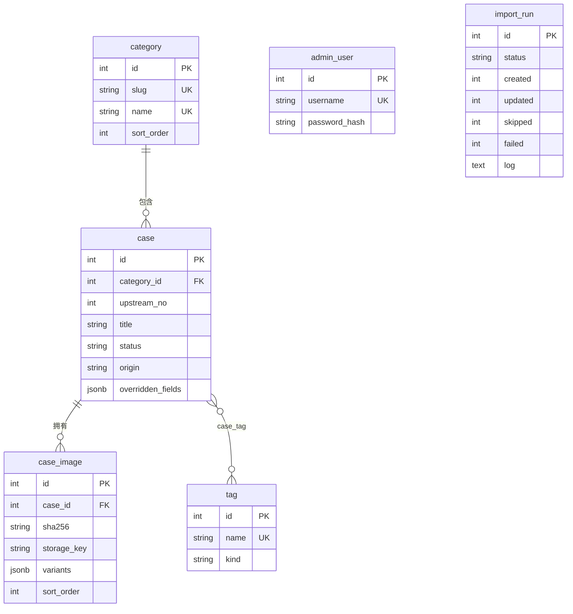

# 数据模型

案例用自增主键标识，上游编号只作为 `(category_id, upstream_no)` 联合唯一键用于幂等导入；图片以 sha256 命名，同一文件被多个案例引用时只存一份。模型定义在 [`backend/app/models.py`](../../backend/app/models.py)，迁移在 `backend/alembic/versions/`。

## 表

| 表 | 关键字段 | 约束与说明 |
| --- | --- | --- |
| `category` | `slug`、`name`、`sort_order` | slug 与 name 各自唯一；slug 用于前台 URL 参数 `c`；有案例时不能删除 |
| `case` | `category_id`、`upstream_no`、`title`、`source_text`、`source_url`、`prompt`、`prompt_zh`、`prompt_en`、`prompt_format`（text/json）、`status`（draft/published/hidden）、`origin`（upstream/manual）、`overridden_fields` | `(category_id, upstream_no)` 唯一，手工案例 `upstream_no` 为空；`overridden_fields` 见 [导入管线](import-pipeline.md#手工修改保护) |
| `case_image` | `storage_key`、`sha256`、`width`、`height`、`bytes`、`dominant_color`、`variants`、`sort_order` | 按 `sort_order, id` 排序，第一张为封面；删除案例时级联删除 |
| `tag` / `case_tag` | `name`、`kind`（style/ratio/model/other） | name 全局唯一；删除标签时级联删除关联 |
| `admin_user` | `username`、`password_hash`、`last_login_at` | 只能用 `atlas create-admin` 创建 |
| `import_run` | `upstream_commit`、`trigger`（cli/admin）、`status`（running/succeeded/failed）、四个计数、`log` | 每次导入一条 |

`created_at`、`updated_at` 由数据库默认值与 ORM 的 `onupdate` 维护。

## 图片存储 key

| 文件 | key | 说明 |
| --- | --- | --- |
| 原图 | `originals/<sha 前 2 位>/<sha>.<jpg\|png\|webp>` | 上游导入保留原始字节；后台上传会重新编码后再计算 sha |
| 缩略图 | `variants/<sha 前 2 位>/<sha>-480.webp` | 长边 480 px，卡片使用 |
| 中图 | `variants/<sha 前 2 位>/<sha>-1080.webp` | 长边 1080 px，详情使用 |

`variants` 字段形如 `{"thumb": {"key", "width", "height"}, "medium": {...}}`。删除图片记录后，只有当没有其他记录引用同一 sha 时才删除文件（[`cleanup_image_files`](../../backend/app/services/admin.py)）。存储接口见 [`services/storage.py`](../../backend/app/services/storage.py)，目前只有本地磁盘实现，切换 OSS 见 [ADR-0006](../adr/0006-local-storage-first.md)。

## 搜索索引文档

Meilisearch `cases` 索引只包含已发布案例，每个案例一条文档，由 [`to_document`](../../backend/app/search/index.py) 生成：

| 字段 | 来源 | 用途 |
| --- | --- | --- |
| `id` | `case.id` | 主键 |
| `title`、`prompt`、`prompt_zh`、`prompt_en`、`source` | 案例字段 | 搜索与高亮 |
| `category`、`category_slug` | 分类名称与 slug | 搜索；按 slug 筛选与分面计数 |
| `tags`、`tag_ids` | 标签名称与 id | 搜索；按 id 筛选 |
| `has_image` | 是否有图片 | 「仅有图」筛选 |
| `created_at` | Unix 秒 | 预留排序 |

索引设置见 [搜索](search.md#索引设置)。
