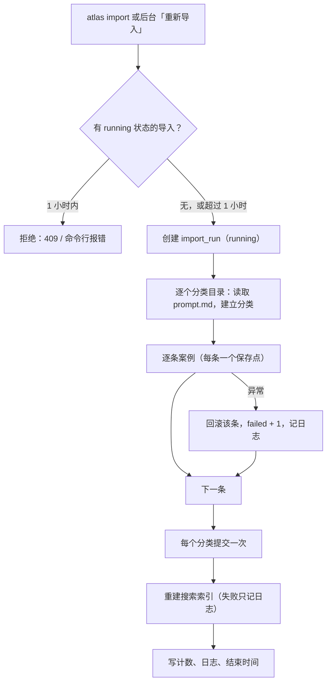

# 导入管线

导入把仓库内的上游快照解析入库：按「分类 + 上游编号」幂等更新，管理员改过的字段不会被覆盖，图片内容不变就不重新处理，完成后全量重建搜索索引。实现在 [`backend/app/importers/image_inspirer.py`](../../backend/app/importers/image_inspirer.py)，操作步骤见 [运维手册](../guides/operations.md#更新上游素材)。

## 流程



超过 1 小时仍为 running 的记录视为中断，会被标记为失败。目录不存在等整体错误会让本次记录为 failed，日志写明原因。

## 快照结构与解析

```text
resources/image-inspirer/
├── UPSTREAM_COMMIT            上游 commit，记录到 import_run
├── LICENSE
└── db/<分类名>/prompt.md       每个「## 例 N：标题」是一个案例
            └── images/caseN.jpg
```

| 解析项 | 规则 |
| --- | --- |
| 案例边界 | 标题行 `## 例 N：标题`，到下一个标题行为止 |
| 来源 | `**来源：** …`；Markdown 链接拆成文本与 URL（仅 http/https）；「未提供」「未标注」「无」视为空 |
| 原文 | 第一个代码块（```` ```text ```` / ```` ```json ```` / 无语言）；没有代码块时取去掉标题、来源、图片、分隔线后的正文 |
| 中英文 | 有 `[中文]`、`[English]`/`[英文]` 标记时按标记拆分；否则中日韩字符占（中日韩 + 拉丁字母）≥ 20% 视为中文，否则英文 |
| 格式 | 原文以 `{` 或 `[` 开头且能被 JSON 解析 → `json`，否则 `text` |
| 比例标签 | 匹配 `a:b`、`a：b`、`a比b`，仅接受 1:1、2:3、3:2、3:4、4:3、4:5、5:4、9:16、16:9、21:9；避免把 `10:30` 等时间当成比例 |
| 分类 slug | 13 个上游分类有固定英文 slug（如「海报与排版」→ `posters`）；新分类为 `category-<序号>` |

## 更新规则

| 情况 | 行为 | 计数 |
| --- | --- | --- |
| 数据库中没有 `(分类, 上游编号)` | 新建，`origin=upstream`、`status=published` | 新增 |
| 已存在，字段有变化 | 更新未被手工修改的字段 | 更新 |
| 已存在，无变化 | 不动 | 未变化 |
| 上游删除了某个案例 | 不删除数据库中的案例（管理员可手动下线） | — |
| 已存在案例的发布状态 | 导入不修改 | — |

### 手工修改保护

后台修改上游案例的以下字段时，字段名会记入 `overridden_fields`，之后的导入跳过这些字段：`category_id`、`title`、`source_text`、`source_url`、`prompt`、`prompt_zh`、`prompt_en`、`prompt_format`，以及 `images`（上传、删除图片或调整封面时）和 `tags`（修改标签时）。只有值真正改变才记录；发布状态不在其中。编辑页的「恢复上游同步」（`clear_overrides: true`）清空列表，下次导入恢复为上游内容。设计理由见 [ADR-0005](../adr/0005-protect-manual-edits-on-reimport.md)。

## 图片处理

[`process_image`](../../backend/app/services/images.py) 被导入与后台上传共用：

1. 只接受 JPEG、PNG、WebP，像素数不超过 6000 万；按 EXIF 方向旋正。
2. 上游图片保留原始字节；后台上传的图片重新编码（有透明通道或 PNG → PNG，否则 JPEG 质量 92），去掉元数据。
3. 以原图 sha256 命名存储，已存在则跳过写入。
4. 生成长边 480 px 与 1080 px 的 WebP（质量 80，不放大小图）。
5. 缩到 1×1 像素取平均色作为主色。

导入时如果案例当前图片的 sha 列表与上游文件一致则跳过；否则替换并清理不再被引用的旧文件。图片处理在线程池中执行，不阻塞事件循环。首次导入 336 张图约 40 秒。
