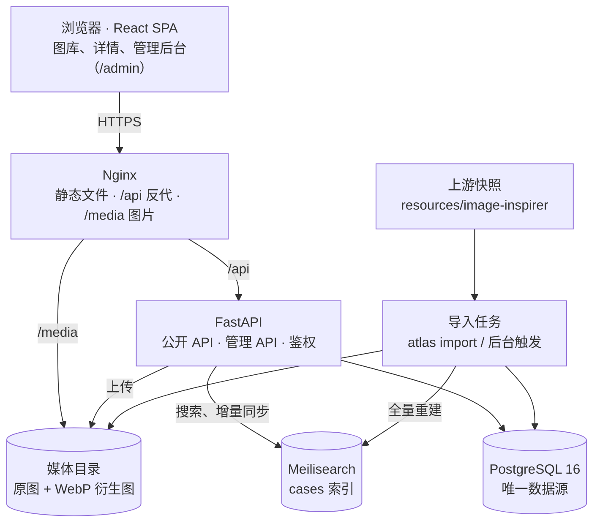

# 架构总览

系统是前后端分离的单仓库：React 单页应用只与 FastAPI 通信；PostgreSQL 是唯一数据源，Meilisearch 只承担站内搜索；图片按内容 hash 存在磁盘上由 Nginx 直接分发；上游素材通过命令行或后台触发的导入任务入库。技术选型的理由见 [ADR 索引](../adr/README.md)。



## 请求怎么走

- **浏览**（无关键词）：`GET /api/v1/cases` → PostgreSQL，按 id 游标分页。
- **搜索**（有关键词）：同一接口 → Meilisearch 返回有序 id 与高亮片段 → 再从 PostgreSQL 取完整数据按序返回；Meilisearch 不可用时改用数据库 ILIKE。详见 [搜索](search.md)。
- **后台写入**：先写 PostgreSQL 并提交，再增量同步 Meilisearch；同步失败只记日志，可手动重建。
- **图片**：接口只返回 `/media/...` 地址；开发时由 FastAPI 的 StaticFiles 提供，生产由 Nginx 提供。

## 代码结构

```text
backend/app/
├── main.py              应用入口：路由挂载、错误处理、启动时确保索引设置
├── core/                配置（ATLAS_ 前缀环境变量）、鉴权与限流、统一错误格式
├── db.py / models.py    SQLAlchemy 异步引擎与模型
├── schemas.py           Pydantic 请求/响应模型（也是 OpenAPI 与前端类型的来源）
├── api/v1/              public.py（前台）、auth.py（登录）、admin.py（后台）
├── services/            cases.py（读）、admin.py（写）、images.py（图片处理）、storage.py、serializers.py
├── search/index.py      Meilisearch 设置、文档映射、同步、搜索
├── importers/           image_inspirer.py：解析与导入
└── cli.py               atlas 命令：import、reindex、create-admin

frontend/src/
├── App.tsx              路由；后台页面按需加载
├── api/                 endpoints.ts（手写请求函数）、generated/（由 OpenAPI 生成的类型）
├── features/gallery/    图库、筛选、虚拟网格
├── features/case-detail/ 详情弹窗与独立页、提示词复制
├── features/admin/      后台各页面
├── components/          通用组件（shadcn 风格）
└── lib/                 请求封装、主题、剪贴板、hooks
```

## 子系统文档

| 文档 | 内容 | 相关需求 |
| --- | --- | --- |
| [数据模型](data-model.md) | 表结构、索引文档、存储 key | 全部 |
| [搜索](search.md) | 索引设置、同步、查询、高亮、降级 | F02、F03、F11 |
| [导入管线](import-pipeline.md) | 解析规则、幂等与手工修改保护、比例标签、图片处理 | F08、F09、F12、F14 |
| [前端](frontend.md) | 路由、URL 状态、数据获取、虚拟列表、主题 | F01–F07、F13 |
| [安全](security.md) | 鉴权、限流、上传校验、部署安全 | F10、N07 |

## 部署拓扑

生产环境是一台阿里云 ECS 上的 Docker Compose：`web`（Nginx + 前端构建产物，暴露 80/443）、`api`（FastAPI，2 个 worker，启动时执行数据库迁移）、`postgres`、`meilisearch`（不暴露端口）。数据卷 `pgdata`、`media`、`meili_data`。详见 [部署指南](../guides/deployment.md)。
