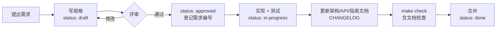

# 文档驱动开发流程

本项目先写文档、再写代码：任何功能变更都从规格文档开始，评审通过后才实现；代码合并时，相关文档必须同时更新到与代码一致。`scripts/docs.py check` 在本地和 CI 中自动检查文档与代码是否脱节。

## 为什么这样做

- **需求可追溯**：每个功能需求有编号（F01…），规格、代码、测试都引用编号，能回答「这个功能为什么存在、在哪里测」。
- **先对齐再动手**：规格写清验收标准后再实现，减少返工；AI 助手（Claude Code）也按规格工作，不凭猜测扩展需求。
- **文档不腐烂**：接口文档和追溯矩阵由代码生成，过期会让检查失败。

## 改动分级

先判断改动属于哪一级，决定需要写哪些文档。

| 级别 | 例子 | 需要的文档 |
| --- | --- | --- |
| 小改动 | 修 bug、文案、样式微调、依赖小版本升级 | 无需规格；行为有变化时更新受影响的文档，并在 `CHANGELOG.md` 记一行 |
| 功能变更 | 新功能、改变已有功能的行为、新增或修改接口、数据模型变更 | **必须先写规格**（`docs/specs/`），并在需求清单中新增或修改需求编号 |
| 架构决策 | 引入或替换技术组件、跨模块的约定、部署方式变化 | **必须写 ADR**（`docs/adr/`）；通常伴随一份规格 |

拿不准时按更高一级处理。

## 功能变更的流程

1. **写规格**：复制 [`docs/specs/_template.md`](../specs/_template.md) 为 `docs/specs/NNNN-简短英文-slug.md`（编号递增），填写背景、目标、验收标准、方案和测试计划，`status: draft`。
2. **评审**：在 PR 或讨论中评审规格。涉及技术选型的，同时起草 ADR。通过后改为 `status: approved`，并在 [需求清单](../product/requirements.md) 中新增或修改对应需求行（状态「规划中」，规格列链接到该规格）。
3. **实现**：状态改为 `in-progress`。测试的名称或文档字符串中写上需求编号（如 `"""F08：导入幂等"""`、`it('F06 复制当前语言', …)`），追溯矩阵据此生成。
4. **同步文档**：按下方「文档归属」表更新受影响的文档；接口有变化时运行 `make docs` 重新生成接口文档与追溯矩阵，并在 `frontend` 运行 `pnpm gen:api` 更新前端类型。
5. **收尾**：`make check` 全部通过；需求清单状态改为「已实现」，规格 `status: done`；`CHANGELOG.md` 的「未发布」下记录改动。

## 文档归属：每类信息只写在一个地方

| 信息 | 唯一来源 | 其他地方的做法 |
| --- | --- | --- |
| 做什么、优先级、做到哪了 | [需求清单](../product/requirements.md) | 规格和测试只引用编号 |
| 某个功能具体怎么做、验收标准 | `docs/specs/` 中对应规格 | 需求清单链接过去 |
| 系统现在是怎样工作的 | `docs/architecture/` | 规格完成后，把长期有效的设计沉淀到这里 |
| 为什么这样选 | `docs/adr/` | 架构文档链接到 ADR，不重复论证 |
| 接口契约 | 后端代码（FastAPI 路由与 Pydantic 模型） | [`docs/api/endpoints.md`](../api/endpoints.md) 与前端类型均由代码生成，不手改 |
| 怎么开发、测试、部署、运维 | `docs/guides/` | README 只放最短的上手步骤并链接过来 |
| 发布了什么 | `CHANGELOG.md` | — |

规格描述「一次变更」，完成后不再修改；架构文档描述「系统现状」，随代码持续更新。

## 完成的定义（Definition of Done）

- [ ] 功能变更有已批准的规格，需求清单中有对应编号
- [ ] 每条验收标准都有测试覆盖，测试名称或文档字符串含需求编号
- [ ] 受影响的架构、接口、指南文档已更新；`make docs` 生成的文件已提交
- [ ] `CHANGELOG.md` 已记录
- [ ] `make check` 通过（后端检查与测试、前端类型检查与测试、文档检查）

## 自动检查

`make docs-check`（即 `scripts/docs.py check`）会检查：

| 检查项 | 失败时怎么办 |
| --- | --- |
| 文档都有 frontmatter（`title`、`status`、`updated`），状态取值合法 | 按 [写作规范](documentation-guide.md) 补齐 |
| 文档内相对链接指向的文件存在 | 修正链接 |
| 规格、ADR 编号连续且已登记在各自的索引里 | 在 `docs/specs/README.md` 或 `docs/adr/README.md` 中补登记 |
| 需求清单中「已实现」的需求至少被一个测试引用 | 补测试，或在测试中标注需求编号 |
| 需求清单引用的规格文件存在 | 修正链接 |
| `docs/api/endpoints.md`、`docs/product/traceability.md` 与代码一致 | 运行 `make docs` 并提交 |

## 与 AI 助手协作

仓库根目录的 [`CLAUDE.md`](../../CLAUDE.md) 规定了 Claude Code 在本项目中的工作方式：收到功能需求时先查找或起草规格，规格未批准不写实现代码；每次改动同步更新文档并运行检查。给 AI 布置任务时，直接引用规格编号或需求编号即可，例如「实现 spec 0003」「修复 F03 的高亮问题」。
