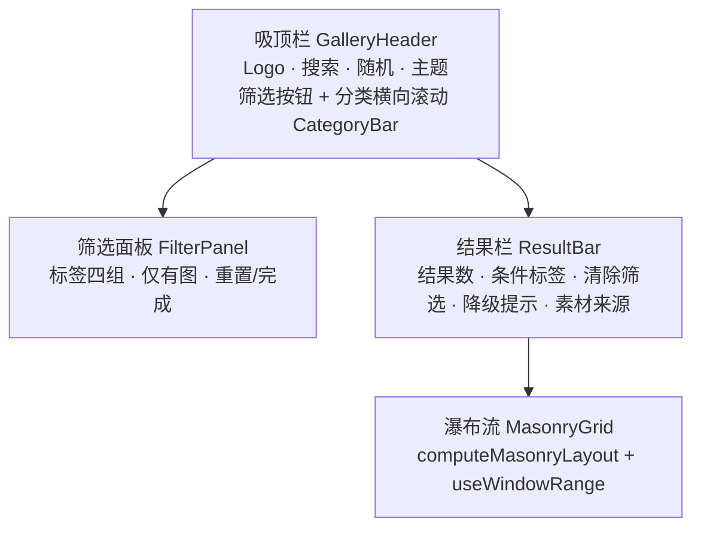

# 规格 0002：前端改版为「暗色沉浸」风格，图库改用瀑布流与吸顶栏

> 2026-09-29 批准并完成实施，规格冻结；系统现状见 [前端架构](../architecture/frontend.md)。视觉决定与备选方案见 [ADR-0010](../adr/0010-frontend-visual-system.md)。

## 背景

第一期前端沿用原站的「野兽派」视觉（纸色网格背景、墨色描边、荧光绿、硬阴影），用户不满意。另外，现在的图库有三个问题：

1. **图片被裁切**：网格统一按 4:5 裁切，而上游图片的高宽比在 0.5 到 3.0 之间，竖长图和横图都被切掉大半。
2. **侧栏占地方**：桌面端左侧栏宽 248 px，只放了 3 个统计数字和素材来源；筛选控件（搜索、分类、4 行标签）都挤在内容区顶部，第一屏看到的图片很少。
3. **大组件难改**：[`GalleryPage.tsx`](../../frontend/src/features/gallery/GalleryPage.tsx) 322 行，[`CaseEditPage.tsx`](../../frontend/src/features/admin/CaseEditPage.tsx) 416 行，状态、数据请求和界面混在一起。

2026-09-29 用 HTML 设计稿比较了四个视觉方向（极简画廊、暗色沉浸、编辑杂志风、柔和现代），用户选定**暗色沉浸**。设计稿见 [`assets/0002/mockup.html`](assets/0002/mockup.html)，用浏览器直接打开即可，图片引用的是仓库内 `resources/` 里的原图。

## 目标与非目标

**目标**

1. 前台图库、案例详情和后台管理全部换成暗色沉浸风格，深浅两套主题都有。
2. 图库改用瀑布流：按图片原始比例排列，图片加载前就占好准确的位置。
3. 去掉左侧栏，改为顶部吸顶栏；标签和「仅有图」收进筛选面板。
4. 拆分大组件，统一使用语义化设计令牌，让之后改功能更容易。
5. 已有功能的行为不变：URL 状态、搜索、详情弹窗与独立页、复制、随机、后台增删改、导入。

**非目标**

- 不改后端接口和数据模型。
- 不加载网络字体，只用系统字体（原因见 ADR-0010）。
- 不做卡片悬停「快速复制」。设计稿里有这个按钮，但列表接口只返回摘要（N01），复制完整提示词需要额外请求一次详情；而且 Safari 在异步请求之后可能拒绝写剪贴板。放到以后的规格里单独做。
- 不做搜索建议、收藏等新功能。

## 需求变更

在 [需求清单](../product/requirements.md) 中修改以下条目：

| 编号 | 变更 | 内容 |
| --- | --- | --- |
| F01 | 修改 | 瀑布流展示案例卡片：按缩略图宽高比排版（高宽比限制在 0.5–2，超出部分裁切），卡片以图片为主；分类、标题、提示词摘要在悬停、键盘聚焦或有搜索词时显示，触屏设备常显标题；滚动到底按游标分页加载，只渲染视口附近的卡片 |
| F03 | 修改 | 末尾补充：「按 `/` 聚焦搜索框」 |
| F13 | 修改 | 改为：「默认深色，可手动切换浅色、深色或跟随系统，刷新不闪烁」 |

F02（分类筛选）和 F12（标签筛选）的行为不变，只是入口换了位置，所以不改需求描述。F05、F06、F10、N06、N08 同样不改描述，由下面的验收标准保证改版后仍然满足。

## 验收标准

每条都要有测试，测试标题里写需求编号。

**瀑布流（F01）**

- **AC-1** 给定列数、容器宽度和一组卡片的缩略图宽高，当计算布局时，每张卡片放进当前累计高度最小的一列（高度相同时取最左一列）；图片高度等于「列宽 × 高宽比」，高宽比限制在 0.5–2；没有封面的卡片按 4:5 占位。
- **AC-2** 给定已经排好的一页卡片，当追加下一页时，已有卡片的位置和尺寸不变。
- **AC-3** 当内容区宽度为 296 px（320 px 视口）或 351 px（375 px 视口）时为 2 列；内容区宽 1416 px（1480 px 及以上视口）时为 6 列；列数在 2–6 之间。
- **AC-4** 在图库连续向下滚动时，接近底部会请求下一页（带 `cursor`），并且页面上渲染的卡片少于 60 张。
- **AC-5** 卡片默认只显示图片；当鼠标悬停或键盘聚焦时，显示分类、标题和两行提示词摘要。当 URL 带搜索词时，所有卡片常显标题和摘要，命中词用 `<mark>` 高亮。触屏设备（`hover: none`）常显标题。

**吸顶栏与筛选（F02、F03、F12）**

- **AC-6** 给定图库已向下滚动 2000 px，那么搜索框、随机按钮、主题切换和分类栏仍然固定在视口顶部可见。
- **AC-7** 当点击「筛选」时打开筛选面板：选一个标签后 URL 带上 `tag`，「筛选」按钮上显示数量 1；关闭「仅有图」后 URL 带上 `all=1`，数量变为 2；按 Esc 关闭面板，焦点回到「筛选」按钮。桌面端面板显示在吸顶栏下方，视口宽度小于 640 px 时改为底部抽屉。
- **AC-8** 当前有分类、标签或「含无图案例」条件时，结果栏把它们显示成可以单独移除的条件标签，并显示「清除筛选」。
- **AC-9** 当焦点不在输入框里时，按 `/` 会聚焦搜索框；在输入框里按 `/` 正常输入字符。

**主题（F13）**

- **AC-10** 首次访问（`localStorage` 中没有 `atlas-theme`）时页面为深色，首帧之前 `<html>` 已带 `dark` 类。选择浅色后刷新，页面仍为浅色。
- **AC-11** 手机宽度（小于 640 px）的吸顶栏里，主题按钮点一次换一种主题，顺序是深色 → 浅色 → 跟随系统；按钮的无障碍名称说明当前主题。桌面端保留三选一的单选组（浅色、跟随系统、深色）。

**详情（F05、F06）**

- **AC-12** 从图库点开卡片后弹出详情弹窗。弹窗显示 Case 编号、分类和标签、标题、来源、提示词（有中文、English、原文时可以切换）和复制按钮；方向键切换上一条和下一条，Esc 关闭后回到原来的滚动位置。直接打开 `/cases/:id` 时显示独立页，内容与弹窗相同，标题是 `h1`，并有「返回图库」链接。
- **AC-13** 视口宽度小于 768 px 时，详情铺满屏幕：图片在上，信息在下，底部固定一条操作栏（上一条、复制、下一条），滚动到任何位置都能复制。

**后台（F10）**

- **AC-14** 后台换成新风格后，原有端到端流程全部通过：未登录跳转、登录、新建（含校验错误）、上传图片、发布、删除、导入记录页。

**响应式、可访问性与署名（N06、N08）**

- **AC-15** 视口宽度为 320 px 和 375 px 时，图库、详情和后台案例列表都没有横向滚动。
- **AC-16** 深浅两套主题中，`--fg` 和 `--muted` 在 `--bg`、`--surface`、`--surface-2` 上的对比度都不低于 4.5:1。`--faint` 的对比度不到 3:1，只能用在分隔线、装饰性图标这类非必要元素上，不能用于正文、计数或输入框占位文字。
- **AC-17** 图库结果栏始终显示素材来源 image-inspirer 的链接和 Apache-2.0 许可。

## 方案

### 接口

无变化。瀑布流用到的缩略图宽高（`cover.thumb.width/height`）和主色（`cover.color`）列表接口已经返回。

### 数据模型

无变化。

### 前端

#### 设计令牌

所有颜色都通过 CSS 变量取用，深浅两套主题各有一组，写在 [`index.css`](../../frontend/src/index.css) 里，再由 Tailwind 的 `@theme inline` 暴露给组件。命名规则见 ADR-0010。

| 令牌 | 用途 | 深色（默认） | 浅色 |
| --- | --- | --- | --- |
| `--bg` | 页面背景 | `#070708` | `#ecebe7` |
| `--surface` | 弹窗、面板、表格 | `#111113` | `#fbfbfa` |
| `--surface-2` | 输入框、分段控件、代码块 | `#1b1b1f` | `#e3e2dd` |
| `--fg` | 正文 | `#f4f3ef` | `#121212` |
| `--muted` | 次要文字、计数 | `#8f8e96` | `#63625a` |
| `--faint` | 分隔符、装饰（见 AC-16） | `#5b5a62` | `#9c9b94` |
| `--border` | 描边 | `rgba(255,255,255,.09)` | `rgba(0,0,0,.09)` |
| `--accent` | 强调：随机按钮、选中的分类、复制按钮、Case 编号 | `#f3b64a` | `#8f5a06` |
| `--accent-fg` | 强调色上的文字 | `#1b1204` | `#ffffff` |
| `--mark` | 搜索命中高亮 | `rgba(243,182,74,.4)` | `rgba(243,182,74,.5)` |
| `--header-bg` | 吸顶栏毛玻璃 | `rgba(20,20,23,.62)` | `rgba(251,251,250,.66)` |
| `--overlay` | 弹窗遮罩 | `rgba(0,0,0,.74)` | `rgba(20,20,20,.55)` |

注：浅色主题的 `--accent` 和 `--muted` 比设计稿里的颜色调深了一些（设计稿是 `#b8740f` 和 `#69685f`），这样才能满足 AC-16。

其他令牌：

- **圆角**：卡片 10 px，按钮和标签为胶囊形，弹窗 20 px，吸顶栏容器 22 px。
- **字体**：
  - 正文：`"Avenir Next", "PingFang SC", "Hiragino Sans GB", "Microsoft YaHei", "Segoe UI", system-ui, sans-serif`。
  - 小号标签（卡片上的分类、`PROMPT ATLAS` 字样）：`"Avenir Next Condensed", "Arial Narrow"`，再接正文字体栈，字距 0.16em。
  - 代码：`"SF Mono", "JetBrains Mono", Menlo, Consolas, monospace`。
- **背景**：深色主题的页面顶部有一圈淡淡的琥珀色光晕，再叠一层 7% 不透明度的噪点纹理（内联 SVG），两者都不影响文字对比度。

#### 图库

- **吸顶栏**：
  - 整块吸顶，外观是一个带毛玻璃背景的圆角容器，距视口顶部 12 px。
  - 第一行（60 px 高）：Logo，居中的搜索框（最宽 620 px，右侧显示 `/` 快捷键提示），随机按钮，主题切换。
  - 第二行（50 px 高）：「筛选」按钮，然后是可横向滚动的分类按钮，每个分类带计数，选中的分类用强调色填充。
  - 视口宽度小于 640 px 时两行高度分别为 58 px 和 46 px，主题切换换成单个按钮（见 AC-11）。
  - 原来侧栏里的统计数字和首页标语不再保留；统计合并进结果栏的来源说明，例如「668 条提示词」。
- **筛选面板**：
  - 桌面端用 Radix Popover（ADR-0010 引入），显示在吸顶栏下方，和内容区等宽，标签按比例、风格、模型、其他分四栏排列。
  - 视口宽度小于 640 px 时改成底部抽屉，用现有的 Radix Dialog。
  - 标签仍然是单选（与现在的 `tag` 查询参数一致），再点一次已选的标签就取消。
  - 底部一行放「仅显示有图案例」开关、「重置」和「完成」。
  - 「筛选」按钮上的数字等于与默认值不同的条件数：选了标签算一个，关闭「仅有图」算一个。
- **结果栏**：
  - 左侧：结果数，已选条件（分类、标签、含无图案例，每个都可以单独移除），「清除筛选」，以及搜索降级时的提示。
  - 右侧（手机上换到下一行）：「素材来自 image-inspirer · Apache-2.0 · N 条提示词」。
  - 列表到底时显示「已经到底了」。
- **瀑布流**：
  - 纯函数 `computeMasonryLayout(items, columns, width, gap)` 计算每张卡片的 `left`、`top`、`width`、`height`，规则见 AC-1。
  - 列数：`clamp(floor((宽 + 间距) / (210 + 间距)), 2, 6)`。间距在视口宽度 ≥ 640 px 时为 6 px，否则为 4 px。内容区最宽 1480 px，左右内边距 32 px，窄屏 12 px。
  - 窗口化：`useWindowRange` 监听滚动和尺寸变化（用 rAF 节流），只渲染视口上下各半屏以内的卡片；视口底部距列表底部不足一屏时加载下一页。（实施时由「各一屏」调整为「各半屏」：6 列时各一屏约渲染 57 张，离 AC-4 的 60 张上限太近。）
  - 追加数据时，从上次的列高继续往下排（AC-2）；列数或宽度变化时整体重新计算。
  - 这套实现取代原来的 `VirtualGrid.tsx`（已删除），之后不再依赖 `@tanstack/react-virtual`。
- **卡片**：
  - 图片区的背景是主色，缩略图加载后淡入。缩略图用 `object-fit: cover`，从顶部开始对齐，这样特别长的图（比如电商详情页）保留的是开头部分。
  - 悬停或聚焦时，图片轻微放大，外圈出现一道由图片主色生成的光晕，底部渐变层显示分类（小号琥珀色字）、标题和两行摘要。
  - 没有封面的卡片显示「暂无图片」。
  - 保留 `aria-label="打开案例 {id}：{标题}"`，以及背景路由的跳转方式。

#### 详情

- **弹窗**：
  - 距视口上下各 28 px，最宽 1220 px。左右两栏，宽度比为 1.12 : 0.88，右栏至少 380 px。
  - 左栏：先把当前图片放大、模糊（60 px）、压暗后铺满作背景，再在上面显示原比例大图。多图时下方有缩略图条，左下角有「查看原图」。
  - 右栏：
    - 顶部一行标记：Case 编号（强调色）、分类、标签。
    - 标题（弹窗里是 `h2`，独立页是 `h1`），下面是来源。
    - 提示词区：分段控件切换中文、English、原文，旁边是字符数和复制按钮（强调色），下面是提示词正文，JSON 原文着色显示。
    - 底部：上一条、下一条，中间是「← → 切换 · Esc 关闭」提示。
- **窄屏（小于 768 px）**：详情铺满屏幕，整体可以滚动。图片区占 56% 高度，至少 360 px。底部操作栏用 `position: sticky` 固定（AC-13）。
- **独立页**：[`CasePage`](../../frontend/src/features/case-detail/CasePage.tsx) 顶部一行放「返回图库」和主题切换，下面复用同一个详情视图。
- **行为保持不变**：背景路由加弹窗、切换案例时用 `replace`、预取相邻案例、复制的三级降级（Clipboard API、`execCommand`、选中文本提示手动复制）。

#### 后台

- 视觉换用同一套令牌。侧栏宽 236 px：品牌、导航、底部的主题切换、「查看前台」和当前用户。表格表头用 `--surface-2`，状态用「圆点 + 文字」表示。
- 窄屏时侧栏变成顶部的横向导航，案例表格变成卡片列表，只显示封面、标题、状态和编辑按钮。
- 功能和文案不变，e2e 依赖的标签和按钮名称也保持原样。

#### 代码结构

| 位置 | 变化 |
| --- | --- |
| `src/index.css` | 换成新令牌（深浅两套）；删除网格背景与 `shadow-hard` |
| `index.html` | 主题预设脚本：没有保存的偏好时默认用深色；`theme-color` 随主题变化 |
| `src/lib/theme.tsx` | 默认偏好从 `system` 改为 `dark` |
| `src/components/ui/` | 按新风格重写 `button`、`badge`、`form-controls`、`dialog`；新增 `popover`、`segmented`、`switch`、`chip`、`empty-state` |
| `src/components/ThemeToggle.tsx` | 保留单选组；新增 `ThemeCycleButton` |
| `src/features/gallery/` | `GalleryPage` 只负责组合；新增 `GalleryHeader`、`CategoryBar`、`FilterPanel`、`ResultBar`、`MasonryGrid`、`masonry.ts`（纯函数）、`useWindowRange.ts`、`useKeywordSync.ts`（把现在的防抖和 URL 双向同步抽出来）；删除 `VirtualGrid.tsx` |
| `src/features/case-detail/` | 重写 `CaseDetailView` 的布局；新增 `DetailActionBar`（窄屏操作栏）；`PromptBlock` 改为使用 `segmented` |
| `src/features/admin/` | `CaseEditPage` 拆成 `caseSchema.ts`（schema、默认值、转换函数）、`CaseForm`、`CaseImageManager`；从 `CasesPage`、`ImportsPage` 抽出 `DataTable` 和 `Pagination` 放进 `shared.tsx` |
| `package.json` | 新增 `@radix-ui/react-popover`；移除 `@tanstack/react-virtual` |

### 需要新的 ADR 吗？

需要：[ADR-0010](../adr/0010-frontend-visual-system.md) 记录视觉方向、令牌命名、不加载网络字体、新增 Radix Popover 和自己实现瀑布流这几个决定。

## 影响的文档

- [x] [前端架构](../architecture/frontend.md)：重写「图库」「详情与复制」「主题」「样式与组件」四节
- [x] [需求清单](../product/requirements.md)：F01、F03、F13 的描述和规格链接
- [x] [测试指南](../guides/testing.md)：e2e 新增的用例与截图说明
- [x] 追溯矩阵（`make docs` 重新生成）
- [x] `CHANGELOG.md`

## 测试计划

| 验收标准 | 测试 | 类型 |
| --- | --- | --- |
| AC-1、AC-2、AC-3 | `F01 computeMasonryLayout 最短列放置、比例限制、追加不移动`、`F01 columnsFor 列数` | 前端单元 |
| AC-4 | 现有 `gallery.spec.ts` 中的滚动分页与卡片数量断言 | 端到端 |
| AC-5 | `F01 F03 CaseCard 有搜索词时常显标题与高亮摘要`；e2e 搜索后 `mark` 可见 | 前端单元 + 端到端 |
| AC-6 | `F02 吸顶栏滚动后仍可见` | 端到端 |
| AC-7 | `F02 F12 FilterPanel 选标签、关闭仅有图、Esc 关闭` | 前端单元 |
| AC-8 | `F02 F12 ResultBar 条件标签可移除` | 前端单元 |
| AC-9 | `F03 按 / 聚焦搜索框` | 前端单元 |
| AC-10 | `F13 首次访问默认深色，选择浅色后刷新保持` | 端到端 |
| AC-11 | `F13 ThemeCycleButton 依次切换` | 前端单元 |
| AC-12 | 现有 `gallery.spec.ts` 的弹窗、方向键、Esc 断言，以及独立页断言 | 端到端 |
| AC-13 | `F05 F06 窄屏详情底部操作栏可复制` | 端到端 |
| AC-14 | 现有 `admin.spec.ts` | 端到端 |
| AC-15 | `N06 320 px 与 375 px 无横向滚动`（图库、详情、后台列表） | 端到端 |
| AC-16 | `N06 设计令牌对比度`：读取 `index.css` 中两套令牌，计算对比度 | 前端单元 |
| AC-17 | `N08 结果栏显示素材来源与许可` | 前端单元 |

## 实施步骤

分四步提交，每一步都要跑通 `make check`：

1. **令牌与基础组件**：`index.css`、`index.html`、`theme.tsx` 和 `components/ui/`。这一步完成后，所有页面已经是新配色，布局暂时还是旧的。
2. **图库**：吸顶栏、筛选面板、结果栏、瀑布流。
3. **详情**：弹窗、独立页、窄屏操作栏。
4. **后台**：换新样式并拆分组件；然后更新文档和 e2e。

## 上线与回滚

纯前端改动，重新构建并部署前端镜像即可，不需要迁移或重建索引。`localStorage` 的键 `atlas-theme` 不变：已经手动选过主题的访客保持原来的选择，只有没选过的人会看到默认深色。回滚就部署上一版前端镜像。

## 待定问题

- [x] 首次访问默认深色，还是像现在一样跟随系统？——已定：默认深色（AC-10）
- [x] 手机上的主题按钮按「深色 → 浅色 → 跟随系统」循环，可以吗？——已定：可以（AC-11）
- [x] 卡片悬停快速复制本期不做，可以吗？——已定：本期不做
- [x] 首页标语「把好看的 AI 图片案例，整理成可搜索的灵感墙」和侧栏里的三个统计数字去掉，可以吗？——已定：去掉，统计并入结果栏
